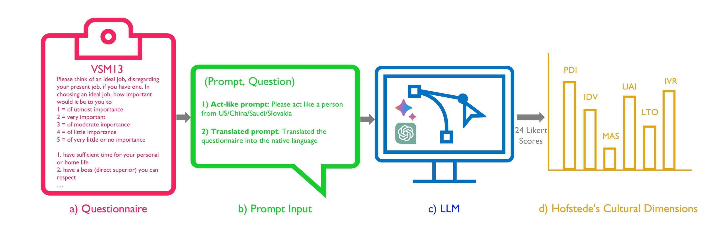

<!-- markdownlint-disable first-line-h1 -->
<!-- markdownlint-disable html -->

<h2>📌 Project Highlight: Hofstede's Cultural Alignment Test (Hofstede's CAT )</h2>

<h3>📖 Abstract:</h3>

        The deployment of large language models (LLMs) raises concerns regarding their cultural misalignment and potential ramifications on individuals from various cultural norms. My recent research introduced the Cultural Alignment Test (CAT) to quantify this alignment. CAT utilizes Hofstede’s cultural dimension framework, providing an insightful cross-cultural comparison through latent variable analysis. The study delved into the cultural values ingrained in top LLMs like ChatGPT and Bard, with a specific focus on countries like the US, Saudi Arabia, China, and Slovakia. Findings from the research offer a quantified understanding of LLMs' cultural alignment, spotlighting GPT-4's exemplary performance in capturing US cultural values.

<h3>🔍 Key Features of CAT:</h3>
<ul>
        <li><strong>Hofstede’s Framework:</strong> A trusted base for cross-cultural comparison.</li>
        <li><strong>In-depth Analysis:</strong> Coverage of diverse prompting styles and hyperparameter settings.</li>
        <li><strong>Quantifiable Metrics:</strong> Measures the cultural alignment of LLMs.</li>
</ul>

<h3>🌍 Cultures Analyzed:</h3>
<ul>
        <li>United States</li>
        <li>Saudi Arabia</li>
        <li>China</li>
        <li>Slovakia</li>
</ul>

<h3>🔬 Methodology:</h3>

    The methodology behind Hofstede's CAT was designed to provide a quantifiable measure of cultural alignment in Large Language Models (LLMs). Here's an overview of our approach:

<ol>
    <li>
        <strong>Framework Adoption:</strong> We began by integrating Hofstede’s cultural dimension framework, a widely-accepted method for cross-cultural comparison.
    </li>
    <li>
        <strong>Model Analysis:</strong> State-of-the-art LLMs like ChatGPT and Bard were assessed for their embedded cultural values.
    </li>
    <li>
        <strong>Country Selection:</strong> Four countries, namely the US, Saudi Arabia, China, and Slovakia, were chosen based on their diverse cultural spectra.
    </li>
    <li>
        <strong>Prompting Styles:</strong> Different prompting techniques and hyperparameter settings were deployed to ensure a comprehensive analysis.
    </li>
    <li>
        <strong>Data Collection:</strong> Responses from LLMs were aggregated and analyzed using latent variable analysis.
    </li>
    <li>
        <strong>Scoring:</strong> CAT scores were assigned to LLMs based on their alignment with the cultural values of the selected countries.
    </li>
</ol>
<figure>
    
    <figcaption>Fig.1 - The proposed framework Hofstede's Cultural Alignment Test (Hofstede's CAT) for LLMs. a) is the VSM13 questionnaire used; b) are the questions prompted to the LLM which have been minimally adjusted to be in the form of a prompt; c) is the LLMs being instructed, i.e., ChatGPT or Google Bard; d) is the resulting Hofstede's cultural dimensions based on the responses generated by the LLM.</figcaption>
</figure>

<h3>📊 Results:</h3>
    <ul>
        <li>GPT-4 outperformed other LLMs in understanding the cultural values of countries, particularly those of the US.</li>
        <li>Differences in LLMs' alignment with explanatory cultural dimensions uncovered.</li>
        <li>Choosing a higher temperature and a moderate top-p improved cultural alignment.</li>
    </ul>
    
<figure>
    
    <figcaption>Fig.2 - Kendall Tau Correlation coefficient of the rankings when prompting the models to act as a person from a specific country.</figcaption>
</figure>

<h3>    </h3>

<figure>
    

    
    <figcaption>Fig.3 - The changes in cultural dimensions upon changing the temperature and top-p settings in GPT-3.5.</figcaption>
</figure>

<!-- Collaborators section -->
<h3>🤝 Collaborators:</h3>
<ul>
    <li><a href="https://sites.google.com/view/ziquanliu">Ziquan Liu</a></li>
    <li><a href="https://github.com/martinferianc">Martin Ferianc</a></li>
    <li><a href="http://www0.cs.ucl.ac.uk/staff/P.Treleaven/">Philip Treleaven</a></li>
    <li><a href="https://www.ucl.ac.uk/iccs/prof-miguel-rodrigues">Miguel Rodrigues</a></li>
    <!-- Add more as needed -->
</ul>

<h3>📄 Publication:</h3>
<ul>
    <li><a href="https://arxiv.org/abs/2309.12342">Cultural Alignment in Large Language Models:
An Explanatory Analysis Based on Hofstede’s Cultural
Dimensions (paper under review)</a></li>
</ul>

  🙏 Thank you for stopping by! Don't forget to ⭐️ star this repository if you find it interesting.

</body>

</html>
