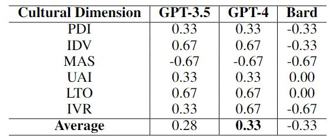
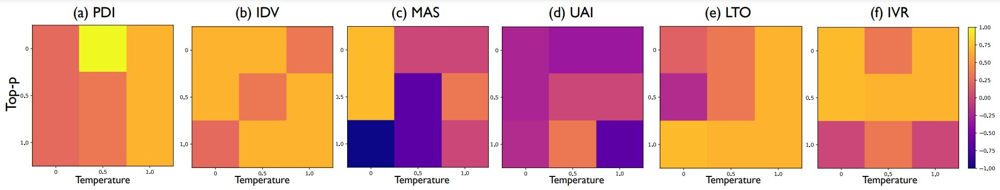

<!-- markdownlint-disable first-line-h1 -->
<!-- markdownlint-disable html -->

<h2>📌 Project Highlight: Hofstede's Cultural Alignment Test (Hofstede's CAT )</h2>

<h3>📖 Abstract:</h3>

        The deployment of large language models (LLMs) raises concerns regarding their cultural misalignment and potential ramifications on individuals from various cultural norms. Our recent research introduced the Cultural Alignment Test (CAT) to quantify this alignment. CAT utilizes Hofstede’s cultural dimension framework, providing an insightful cross-cultural comparison through latent variable analysis. The study examined the cultural values ingrained in top LLMs like ChatGPT and Bard, with a specific focus on countries like the US, Saudi Arabia, China, and Slovakia. Findings from the research offer a quantified understanding of LLMs' cultural alignment, spotlighting GPT-4's exemplary performance in capturing US cultural values.

<h3>🔍 Key Features of CAT:</h3>
<ul>
        <li><strong>Hofstede’s Framework:</strong> A trusted base for cross-cultural comparison.</li>
        <li><strong>In-depth Analysis:</strong> Coverage of diverse prompting styles and hyperparameter settings.</li>
        <li><strong>Quantifiable Metrics:</strong> Measures the cultural alignment of LLMs.</li>
</ul>

<h3>🌍 Cultures Analyzed:</h3>
<ul>
        <li>United States</li>
        <li>Saudi Arabia</li>
        <li>China</li>
        <li>Slovakia</li>
</ul>

<h3>🔬 Methodology:</h3>

The methodology behind Hofstede's CAT was designed to provide a quantifiable measure of cultural alignment in LLMs. Here's an overview of our approach:

<ol>
    <li><strong>Framework Adoption:</strong> We began by integrating Hofstede’s cultural dimension framework
    We used the VSM13 survey to assess cultural alignment in LLMs, which involves 30 questions, including 24 on cultural dimensions and 6 on demographics. The ranking of these dimensions serves as a benchmark.

<li><strong>Prompting:</strong></li>
<ol>
    <li><strong>Model Level:</strong> Assesses default cultural values in English, Arabic, and Chinese.</li>
    <li><strong>Country Level:</strong> Prompts LLMs in English to act like a person from specific countries.</li>
    <li><strong>Hyperparameter:</strong> Examines temperature and top-p settings in GPT-3.5.</li>
    <li><strong>Response Level:</strong> Analyzes consistency of responses.</li>
    <li><strong>Language Correlation:</strong> Compares cultural values of LLMs fine-tuned for English and Chinese.</li>
</ol>

<li><strong>Cultural Dimensions:</strong> Six index scores are computed from the VSM13 responses.</li>

<li><strong>Correlation and Misclassification:</strong> The Kendall Tau coefficient is used to rank correlations, and misclassification errors identify culturally misaligned countries.</li>

<h3>🔬 Experiments:</h3>

We evaluated the cultural alignment of three LLMs: GPT-3.5, GPT-4, and Llama 2, focusing on the United States, China, and Arab countries, using Hofstede's cultural dimensions.

<h4>📈 Model Level Comparison:</h4>

    We compared the models' rankings with the original VSM13 values in English, Chinese, and Arabic. 
    GPT-4 performed better than GPT-3.5, with average Kendall Tau correlations of 0.11 and -0.06, respectively.

<h4>🌐 Country Level Comparison:</h4>

    We then assessed the models acting as people from specific countries. 
    GPT-4 showed better adaptation, while GPT-3.5 and Llama 2 faced challenges. 
    The percentage of mis-ranked dimensions was highest for the United States.

<h4>🎚️ Hyperparameter Comparison:</h4>

    We examined temperature and top-p settings in GPT-3.5. 
    Moderate settings improved alignment, highlighting the importance of hyperparameters for cultural sensitivity.

<h4>🗣️ Language Correlation:</h4>

    We compared Llama 2 models fine-tuned on English and Chinese. 
    The English-trained model showed greater cultural deviation, while the Chinese-trained model aligned better.

<h3>📊 Results:</h3>
    <ul>
        <li>GPT-4 outperformed other LLMs in understanding the cultural values of countries, particularly those of the US.</li>
        <li>Differences in LLMs' alignment with explanatory cultural dimensions uncovered.</li>
        <li>Choosing a higher temperature and a moderate top-p improved cultural alignment.</li>
    </ul>
    
<figure>
    
    <figcaption>Fig.2 - Kendall Tau Correlation coefficient of the rankings when prompting the models to act as a person from a specific country.</figcaption>
</figure>

<h3>    </h3>

<figure>
    

    
    <figcaption>Fig.3 - The changes in cultural dimensions upon changing the temperature and top-p settings in GPT-3.5.</figcaption>
</figure>

<h3>📽️ Demo:</h3>

Try out our demo on <a href="link">Google Colab</a> to explore the cultural alignment of your desired LLMs.

<!-- Collaborators section -->
<h3>🤝 Collaborators:</h3>
<ul>
    <li><a href="https://sites.google.com/view/ziquanliu">Ziquan Liu</a></li>
    <li><a href="https://github.com/martinferianc">Martin Ferianc</a></li>
    <li><a href="http://www0.cs.ucl.ac.uk/staff/P.Treleaven/">Philip Treleaven</a></li>
    <li><a href="https://www.ucl.ac.uk/iccs/prof-miguel-rodrigues">Miguel Rodrigues</a></li>
    <!-- Add more as needed -->
</ul>

<h3>📄 Publication:</h3>
<ul>
    <li><a href="https://arxiv.org/abs/2309.12342">Cultural Alignment in Large Language Models:
An Explanatory Analysis Based on Hofstede’s Cultural
Dimensions (paper under review)</a></li>
</ul>

<h3>Citation</h3>
<pre><code>
@inproceedings{
masoud2024cultural,
title={Cultural Alignment in Large Language Models: An Explanatory Analysis Based on Hofstede's Cultural Dimensions},
author={Reem Masoud and Ziquan Liu and Martin Ferianc and Philip Colin Treleaven and Miguel R. D. Rodrigues},
booktitle={Global AI Cultures  @ ICLR 2024},
year={2024},
url={https://openreview.net/forum?id=HFt68VRiCb}
}
</code></pre>

  🙏 Thank you for stopping by! Don't forget to ⭐️ star this repository if you find it interesting.

</body>

</html>
